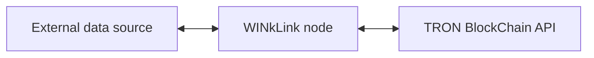
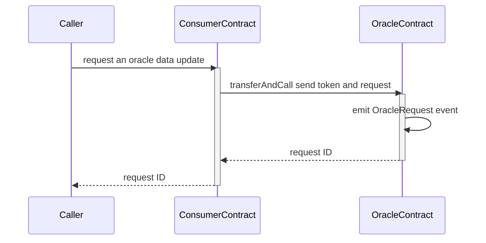
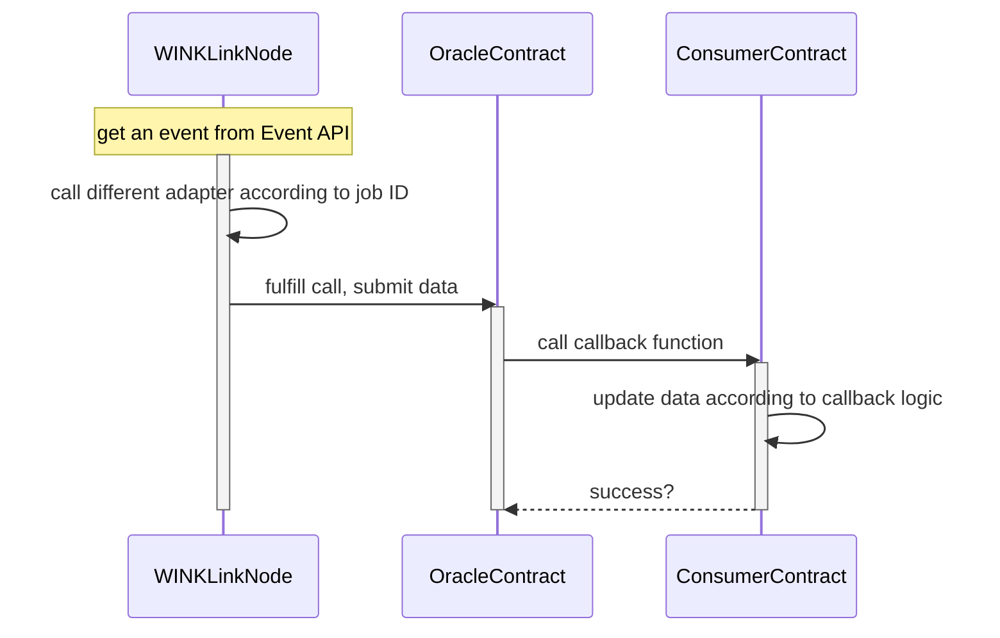

# Introduction to WINkLink
## What is Oracle
For quite some time, smart contracts powered by blockchain have been unable to directly communicate with external systems, which has limited the variety of smart contract-based applications.

The introduction of an oracle provides a solution to connect smart contracts with the outside world. However, most oracles on the market are currently centralized, which exposes corresponding smart contracts to the risk of a single point of failure, compromising the benefits promised by their decentralized nature.

## What is WINkLink

WINkLink is a decentralized oracle project that operates on the TRON network. For more information about the TRON Network and its development basics, please visit [TRON Developer Hub](https://developers.tron.network).

WINkLink has created a decentralized oracle project that provides external data for smart contracts. It connects smart contracts with various real-life events while ensuring a high level of security and reliability

With the sharp rise of various DeFi applications, a stable and reliable decentralized oracle service is essential for premium DeFi projects. This is where WINkLink comes in, as it addresses the needs of TRON-based smart contracts to access external data.

## How WINkLink Works
WINkLink Node Model

The WINkLink oracle node structure consists of three main modules, as illustrated above:

- External data source 
- WINkLink node
- TRON blockchain

Let us take a closer look at each of these modules.

### External Data Source

The external data source module encompasses all the external data that is available to the native blockchain. This includes centralized exchanges, centralized oracles, stock exchange APIs, and other such sources of data.

### WINkLink Node

The WINkLink node is responsible for running task processing, monitoring on-chain contract requests (via Event), retrieving data from external data sources, and submitting results to the blockchain.

### TRON blockchain

The TRON blockchain node primarily consists of the API services provided by the TRON blockchain. These include Fullnode API and Event API services. Through these APIs, the WINkLink node can monitor specific contract events to trigger tasks, sign and broadcast transactions, and return data back to the **consumer contract**.

As indicated by the double-headed arrow, the WINkLink node subscribes to blockchain events while broadcasting transactions via API and returning data results.

## WINkLink Request Model

### Create a Request

### Process a Request

The Oracle's contract events asynchronously trigger the following procedure:

## WINkLink Off-Chain Reporting Model

Off-Chain Reporting (OCR) is a new method for aggregating data that promises to improve scalability, stability, and decentralization in the WINkLink network.

With OCR, all nodes in the network interact through a peer-to-peer (P2P) network, with one node acting as the leader and the others as followers. The P2P network uses a lightweight consensus algorithm during communication. Each node reports its signed data observation back to the leader, who generates a consolidated report. If the transmission conditions are met, this report is broadcast onto the blockchain as a single aggregate transaction. This process leads to a single aggregate transaction, which greatly reduces gas consumption.

The aggregated transaction contains a report that is signed by a quorum of oracles and includes all their observations. To maintain the trustlessness properties of WINkLink oracle networks, the report is validated on-chain and the quorum's signatures are verified on-chain.

Currently, the Off-Chain Reporting model is still in its beta phase, and additional information will be made available once it has been stabilized.

## How to Participate in WINkLink

Depending on the role you want to assume in the WINkLink ecosystem, you can choose to do the following:

For using WINkLink price service in DApps: [Price Service](pricing.md)

For using WINKLink Verifiable Random Function (VRF) service in Dapps: [VRF](vrf.md)

## WINkLink Community

Welcome to the WINkLink ecosystem.

- Telegram: [Join Channel](https://t.me/joinchat/PDRBbhkNbOJd_6DJS4lRoA)
- Github Project: <https://github.com/wink-link/winklink>
- Developer E-mail: <developer@winklink.org>