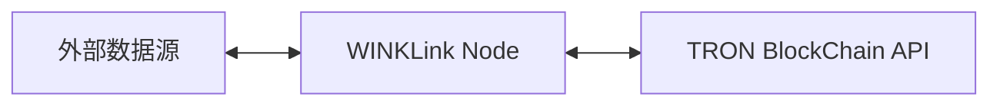
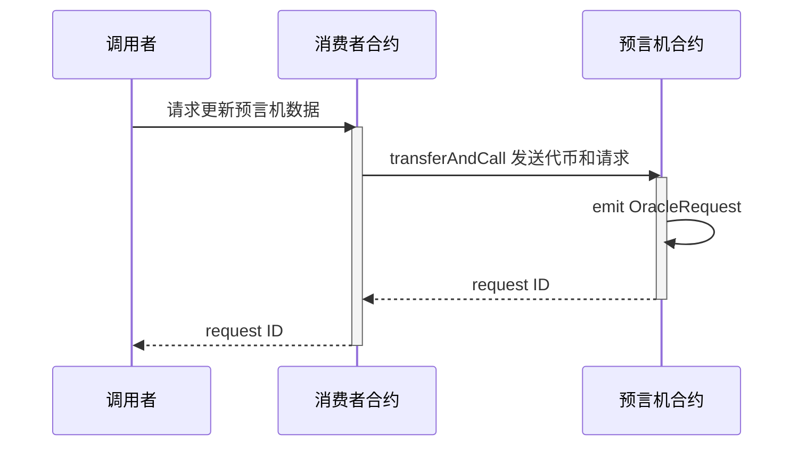
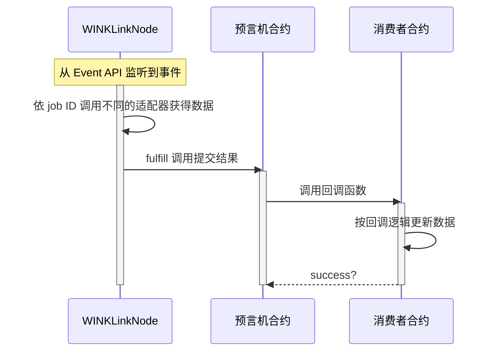

# 系统架构设计
<!-- Architecture Overview -->

## WINKLink 节点模型

如上图，我们可以看到三个主要模块：

* 外部数据源
* WINKLink 节点
* TRON blockchain

这些是 WINKLink 预言机节点架构的主要组成部分，下面我们将逐个介绍。

### 外部数据源

外部数据源代表原生区块链外部可获取的数据，例如中心化交易所、中心化预言机、股票交易所的 API 接口等。

### WINKLink 节点

WINKLink 节点运行任务处理，监听链上合约请求(以 Event 方式监听)，从外部数据源获取数据，然后向区块链提交数据结果。

### TRON blockchain

区块链节点主要指 TRON 区块链提供的 API 服务，包括 Fullnode API 和 Event API 服务。
通过这些 API, WINKLink 节点可以监听特定合约事件来启动任务，同时也可以通过 API 服务签名广播交易，
将数据返回给**消费者合约**。

箭头表示的连接性是双向的, WINKLink 节点既订阅区块链事件，又通过 API 发布交易，提交数据结果。

## WINKLink 请求模型

### 创建请求

### 处理请求

预言机合约的事件会异步触发如下流程：

## 聚合请求模型

在实际应用中，往往需要通过聚合多个预言机的方法来获得更准确的结果，同时过滤掉异常值。

例如价格聚合功能，从多个交易所提供的预言机服务聚合得到平均价格或中位数价格。

价格聚合相关逻辑参考: [AggregatorInterface](https://github.com/wink-link/winklink/blob/master/tvm-contracts/v1.0/TronUser.sol)
