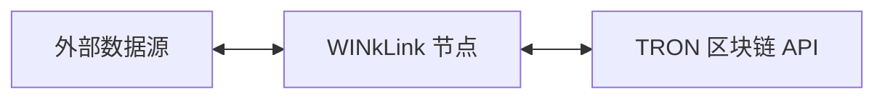
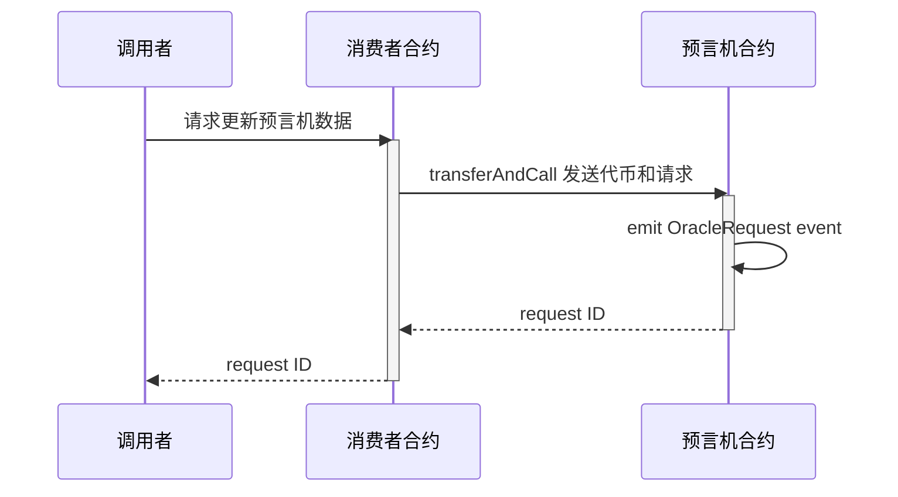

# 项目介绍
## 什么是预言机

长久以来，区块链上运行的智能合约无法直接的与外部系统进行交流，这一瓶颈限制了智能合约应用场景。

如今，我们可以通过引入预言机(Oracle)来解决这一问题，预言机为智能合约提供了与外部世界的连接性。 但是目前的预言机大都是中心化的服务，这会给使用预言机服务的智能合约带来单点故障的风险，使得智能合约的去中心化特性变得毫无意义。

## 什么是 WINkLink

WINkLink 是运行在 TRON 网络上的去中心化预言机项目。关于 TRON 网络及其基础开发相关知识， 请参考 TRON [开发者中心](https://cn.developers.tron.network/)。

WINkLink 开发了去中心化预言机项目， 来向智能合约提供外部数据。在不失安全性和确定性的前提下，智能合约与真实世界中发生的各类事件联系了起来。

目前各类 DeFi 应用不断涌现，高质量的 DeFi 往往依赖稳定准确的去中心化预言机服务。 WINkLink 正是应时而生，解决了 TRON 上智能合约对外部世界数据的需求。

## WINkLink 运作原理
WINkLink 节点模型


如上图，我们可以看到三个主要模块：

- 外部数据源
- WINkLink 节点
- TRON 区块链

这些是 WINkLink 预言机节点架构的主要组成部分，下面我们将逐个介绍。


### 外部数据源

外部数据源代表原生区块链外部可获取的数据，例如中心化交易所、中心化预言机、股票交易所的 API 接口等。

### WINkLink 节点

WINkLink 节点运行任务处理，监听链上合约请求(以 Event 方式监听)，从外部数据源获取数据，然后向区块链提交数据结果。

### TRON 区块链

区块链节点主要指 TRON 区块链提供的 API 服务，包括 Fullnode API 和 Event API 服务。 

通过这些 API, WINkLink 节点可以监听特定合约事件来启动任务，同时也可以通过 API 服务签名广播交易， 将数据返回给消费者合约。

箭头表示的连接性是双向的, WINkLink 节点既订阅区块链事件，又通过 API 发布交易，提交数据结果。

## WINkLink 请求模型

### 创建请求



### 处理请求

预言机合约的事件会异步触发如下流程：

```mermaid
sequenceDiagram
    Note over WINkLinkNode: 从 Event API 监听到事件
    activate WINkLinkNode
    WINkLinkNode->>WINkLinkNode: 依 job ID 调用不同的适配器获得数据
    WINkLinkNode->>预言机合约: fulfill 调用提交结果
    activate 预言机合约
    预言机合约->>消费者合约: 调用回调函数
    activate 消费者合约
    消费者合约->>消费者合约: 按回调逻辑更新数据
    消费者合约-->>预言机合约: success?
    deactivate 消费者合约
    deactivate 预言机合约
    deactivate WINKLinkNode

```

## 链下报告(OCR)

链下报告（OCR）是一种新的数据聚合方法，旨在提高WINkLink网络的可扩展性、稳定性和去中心化。

通过OCR，网络中的所有节点通过点对点（P2P）网络进行交互，其中一个节点充当领导者，其他节点充当跟随者。P2P网络在通信过程中使用轻量级共识算法。

每个节点将其签名的数据观察结果报告给领导者，领导者生成一个合并报告。如果满足传输条件，该报告作为单个聚合交易广播到区块链上。这个过程会产生一个单一的聚合交易，大大降低了燃气消耗。

聚合交易包含了由一组预言机签名的报告，其中包含了他们所有的观察结果。为了维护WINkLink预言机网络的不可信任特性，该报告在链上进行验证，并且验证预言机组的签名。

目前，链下报告模型仍处于测试阶段，一旦稳定下来，将会提供更多的信息。

## 如何参与 WINkLink

取决于你想在 WINkLink 生态中的角色，你可以选择如下：

- 如果你想在 DApp 中 使用 WINkLink 价格服务：[价格服务](pricing.md)

- 如果你想 了解 WINkLink 的实现细节：[架构介绍](vrf.md)

## WINkLink 社区

欢迎加入 WINkLink 生态。

- Telegram: [Join Channel](https://t.me/joinchat/PDRBbhkNbOJd_6DJS4lRoA)
- Github 项目: <https://github.com/wink-link/winklink>
- Support E-mail: <developer@winklink.org>
