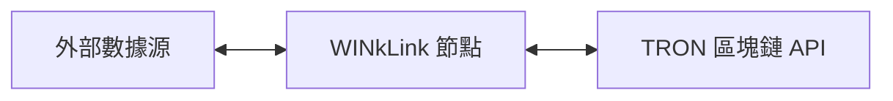
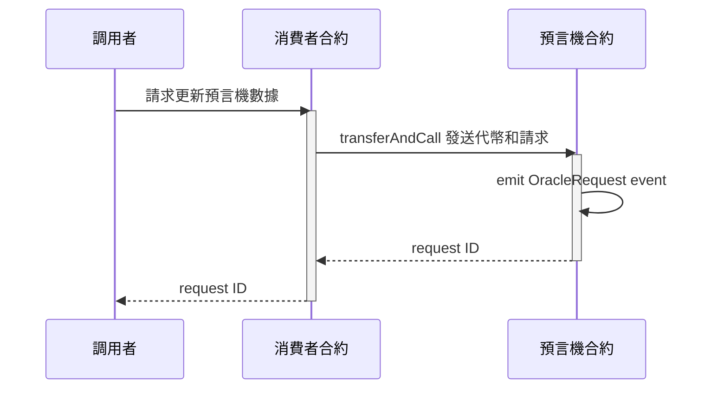
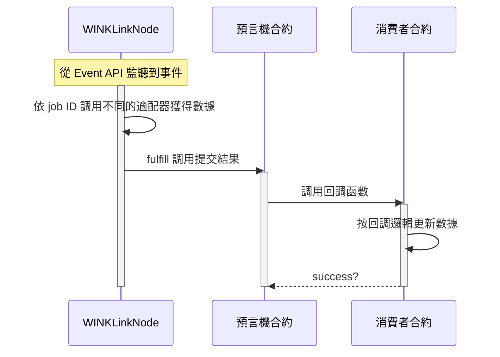

# 項目介紹
## 什麽是預言機

長久以來，區塊鏈上運行的智能合約無法直接的與外部系統進行交流，這一瓶頸限制了智能合約應用場景。

如今，我們可以通過引入預言機(Oracle)來解決這一問題，預言機為智能合約提供了與外部世界的連接性。 但是目前的預言機大都是中心化的服務，這會給使用預言機服務的智能合約帶來單點故障的風險，使得智能合約的去中心化特性變得毫無意義。

## 什麽是 WINkLink

WINkLink 是運行在 TRON 網絡上的去中心化預言機項目。關於 TRON 網絡及其基礎開發相關知識， 請參考 TRON [開發者中心](https://cn.developers.tron.network/)。

WINkLink 開發了去中心化預言機項目， 來向智能合約提供外部數據。在不失安全性和確定性的前提下，智能合約與真實世界中發生的各類事件聯系了起來。

目前各類 DeFi 應用不斷湧現，高質量的 DeFi 往往依賴穩定準確的去中心化預言機服務。 WINkLink 正是應時而生，解決了 TRON 上智能合約對外部世界數據的需求。

## WINkLink 運作原理
WINkLink 節點模型

如上圖，我們可以看到三個主要模塊：

- 外部數據源
- WINkLink 節點
- TRON 區塊鏈

這些是 WINkLink 預言機節點架構的主要組成部分，下面我們將逐個介紹。

### 外部數據源

外部數據源代表原生區塊鏈外部可獲取的數據，例如中心化交易所、中心化預言機、股票交易所的 API 接口等。

### WINkLink 節點

WINkLink 節點運行任務處理，監聽鏈上合約請求(以 Event 方式監聽)，從外部數據源獲取數據，然後向區塊鏈提交數據結果。

### TRON 區塊鏈

區塊鏈節點主要指 TRON 區塊鏈提供的 API 服務，包括 Fullnode API 和 Event API 服務。 

通過這些 API, WINkLink 節點可以監聽特定合約事件來啟動任務，同時也可以通過 API 服務簽名廣播交易， 將數據返回給消費者合約。

箭頭表示的連接性是雙向的, WINkLink 節點既訂閱區塊鏈事件，又通過 API 發布交易，提交數據結果。

## WINkLink 請求模型

### 創建請求

### 處理請求

预言机合约的事件会异步触发如下流程：

## 鏈下報告(OCR)

鏈下報告（OCR）是一種新的數據聚合方法，旨在提高WINkLink網絡的可擴展性、穩定性和去中心化。

通過OCR，網絡中的所有節點通過點對點（P2P）網絡進行交互，其中一個節點充當領導者，其他節點充當跟隨者。P2P網絡在通信過程中使用輕量級共識算法。每個節點將其簽名的數據觀察結果報告給領導者，領導者生成一個合並報告。如果滿足傳輸條件，該報告作為單個聚合交易廣播到區塊鏈上。這個過程會產生一個單一的聚合交易，大大降低了燃氣消耗。

聚合交易包含了由一組預言機簽名的報告，其中包含了他們所有的觀察結果。為了維護WINkLink預言機網絡的不可信任特性，該報告在鏈上進行驗證，並且驗證預言機組的簽名。

目前，鏈下報告模型仍處於測試階段，一旦穩定下來，將會提供更多的信息。

## 如何參與 WINkLink

取決於你想在 WINkLink 生態中的角色，你可以選擇如下：

- 如果你想在 DApp 中 使用 WINkLink 價格服務：[价格服务](pricing.md)

- 如果你想 了解 WINkLink 的實現細節：[架构介绍](vrf.md)

## WINkLink 社區

歡迎加入 WINkLink 生態。

- Telegram: [Join Channel](https://t.me/joinchat/PDRBbhkNbOJd_6DJS4lRoA)
- Github 項目: <https://github.com/wink-link/winklink>
- Support E-mail: <developer@winklink.org>
