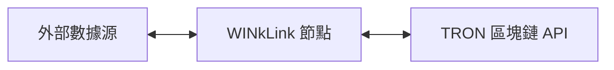
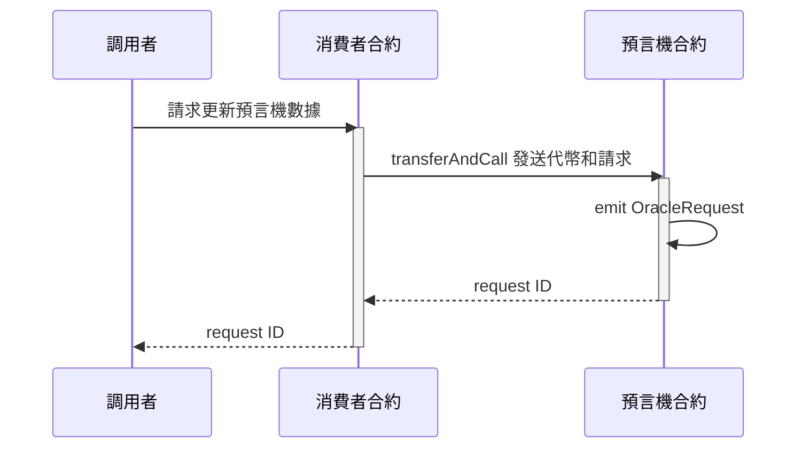
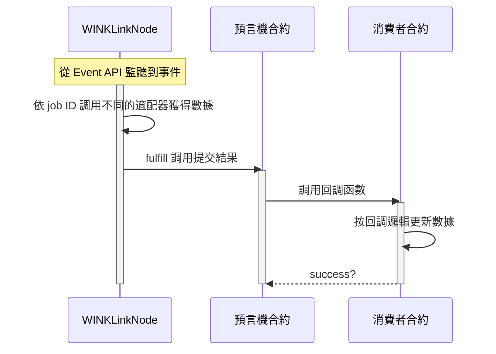

# 系統架構設計
<!-- Architecture Overview -->

## WINkLink 節點模型

如上圖，我們可以看到三個主要模塊：

* 外部數據源
* WINkLink 節點
* TRON 區塊鏈

這些是 WINkLink 預言機節點架構的主要組成部分，下面我們將逐個介紹。

### 外部數據源

外部數據源代表原生區塊鏈外部可獲取的數據，例如中心化交易所、中心化預言機、股票交易所的 API 接口等。

### WINkLink 節點

WINkLink 節點運行任務處理，監聽鏈上合約請求(以 Event 方式監聽)，從外部數據源獲取數據，然後向區塊鏈提交數據結果。

### TRON 區塊鏈

區塊鏈節點主要指 TRON 區塊鏈提供的 API 服務，包括 Fullnode API 和 Event API 服務。
通過這些 API，WINkLink 節點可以監聽特定合約事件來啟動任務，同時也可以通過 API 服務簽名廣播交易，
將數據返回給**消費者合約**。

箭頭表示的連接性是雙向的，WINkLink 節點既訂閱區塊鏈事件，又通過 API 發布交易，提交數據結果。

## WINkLink 請求模型

### 創建請求

### 處理請求

預言機合約的事件會異步觸發如下流程：

## 聚合請求模型

在實際應用中，往往需要通過聚合多個預言機的方法來獲得更準確的結果，同時過濾掉異常值。

例如價格聚合功能，從多個交易所提供的預言機服務聚合得到平均價格或中位數價格。

價格聚合相關邏輯參考: [FluxAggregator.sol](https://github.com/wink-link/winklink/blob/master/tvm-contracts/v2.0/AggregatorInterface.sol)

## 鏈下報告(OCR)

鏈下報告（OCR）是一種新的數據聚合方法，旨在提高WINkLink網絡的可擴展性、穩定性和去中心化。

通過OCR，網絡中的所有節點通過點對點（P2P）網絡進行交互，其中一個節點充當領導者，其他節點充當跟隨者。P2P網絡在通信過程中使用輕量級共識算法。每個節點將其簽名的數據觀察結果報告給領導者，領導者生成一個合併報告。如果滿足傳輸條件，該報告作為單個聚合交易廣播到區塊鏈上。這個過程會產生一個單一的聚合交易，大大降低了燃氣消耗。

聚合交易包含了由一組預言機簽名的報告，其中包含了他們所有的觀察結果。為了維護WINkLink預言機網絡的不可信任特性，該報告在鏈上進行驗證，並且驗證預言機組的簽名。

目前，鏈下報告模型仍處於測試階段，一旦穩定下來，將會提供更多的信息。
