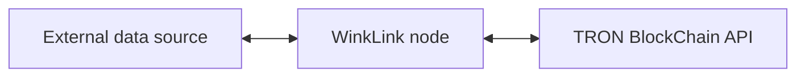
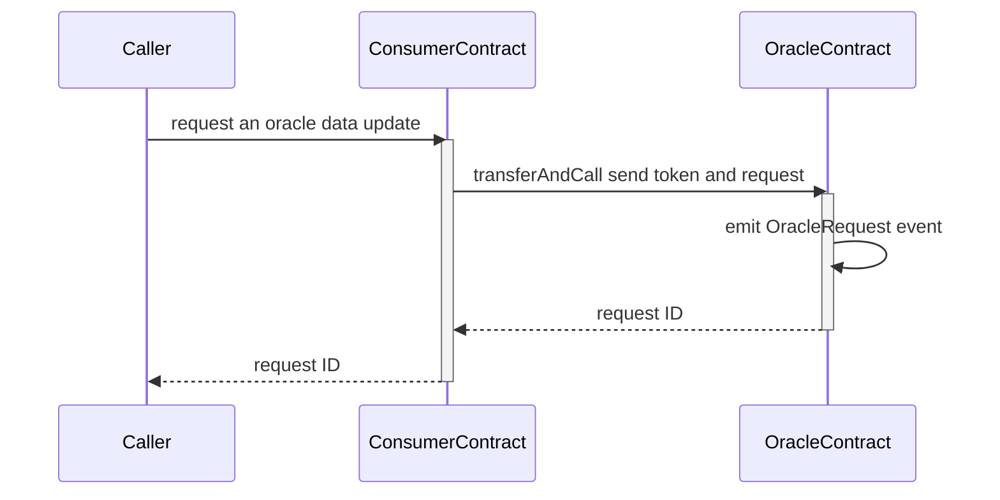
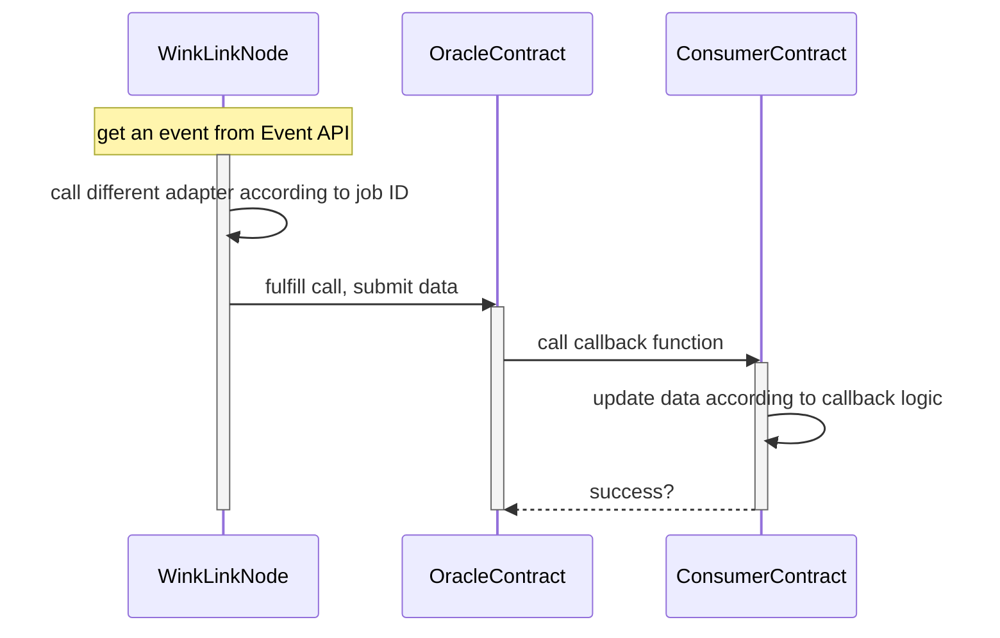

# Design of System Architecture
<!-- Architecture Overview -->

## WinkLink Node Model

There are three main modules as illustrated above:

- External data source
- WinkLink node
- TRON blockchain

Above are the main components that make up the node structure of WinkLink oracle. We will introduce them one by one.

### External Data Source

External data source refers to the external data available to the native blockchain, including centralized exchanges, centralized oracles, stock exchange APIs, etc.

### WinkLink Node

WinkLink node runs task processing, monitors on-chain contract requests (via Event), retrieves data from external data sources and submits results to the blockchain.

### TRON blockchain

Blockchain node mainly refers to the API services provided by the TRON blockchain, including Fullnode API and Event API services. Through these APIs, WinkLink node can monitor specific contract events to trigger tasks, sign broadcasted transactions and return data back to **the consumer contract**.

As suggested by the double-headed arrow, WinkLink node subscribes blockchain events while broadcasting transactions via API and returning data results.

## WinkLink Request Model

### Create a Request

### Process a Request

Oracle's contract events will asynchronously trigger the following procedure:

## Aggregation Request Model

In actual implementation, multiple oracles need to be aggregated to obtain more accurate results and filter out outliers.

For example, the price aggregation feature retrieves information from multiple oracles and generates an average price or a median price.

To learn more about the logic of price aggregation, please refer to: [AggregatorInterface](https://github.com/wink-link/winklink/blob/master/tvm-contracts/v1.0/TronUser.sol).
